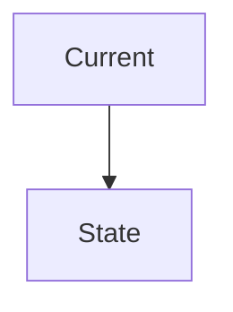
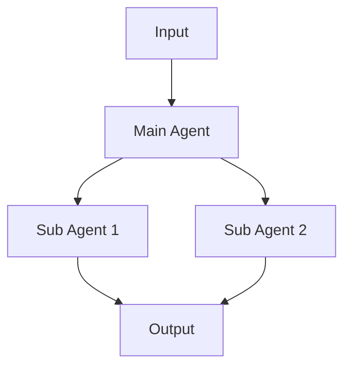
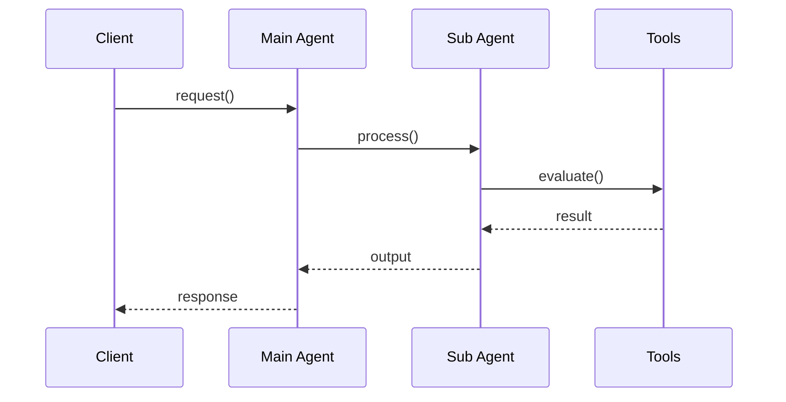

# [Agent Name]

## Context

### 배경

[에이전트의 목적과 필요성]

### 해결하려는 문제

1. **문제 1**: 설명
2. **문제 2**: 설명

### 현재 아키텍처 (있는 경우)



**문제점**:
- 문제점 1
- 문제점 2

## Requirements

### 기능적 요구사항

- [ ] 요구사항 1
- [ ] 요구사항 2
- [ ] 요구사항 3

### 비기능적 요구사항

- [ ] **성능**: 응답 시간 목표
- [ ] **비용**: 토큰 사용량 목표
- [ ] **일관성**: 평가 일관성 목표

### Out of Scope

- 제외 항목 1
- 제외 항목 2

## Agent Architecture

### 제안 구조



### Agent 역할과 책임

#### Main Agent

**역할**: [에이전트의 주요 역할]

**책임**:
- 책임 1
- 책임 2
- 책임 3

**입력**: `param1`, `param2`
**출력**: `OutputSchema`

#### Sub-agents (있는 경우)

| Agent | 담당 | 처리 방식 | 비고 |
|:------|:-----|:----------|:-----|
| **Agent1** | 작업 1 | LLM/규칙 기반 | 설명 |
| **Agent2** | 작업 2 | LLM/규칙 기반 | 설명 |

### Prompt 설계

#### 현재 (문제가 있는 경우)

```
[현재 프롬프트 구조]
```

**문제점**: 문제 설명

#### 개선 (제안)

```
[개선된 프롬프트 구조]
```

**효과**: 개선 효과

### Tools/Functions

#### LLM 판단 항목
- 항목 1: 설명
- 항목 2: 설명

#### 규칙 기반 도구
- 도구 1: 설명 및 로직
- 도구 2: 설명 및 로직

#### 외부 API (있는 경우)
- API 1: 용도
- API 2: 용도

### 에이전트 간 상호작용



**처리 전략**:
- 병렬/순차 처리 방식
- 데이터 전달 방식
- 오류 처리 방식

### 입/출력 스키마

#### Input Schema

```python
{
  "param1": "value",
  "param2": { ... }
}
```

#### Output Schema

```python
{
  "result": { ... },
  "metadata": { ... }
}
```

## Edge Cases

### 1. LLM API 실패

**시나리오**: [상황 설명]

**처리 방식**:
- 대응 방법 1
- 대응 방법 2

### 2. 프롬프트 최적화

**시나리오**: [상황 설명]

**처리 방식**:
- 대응 방법 1
- 대응 방법 2

### 3. [기타 Edge Case]

**시나리오**: [상황 설명]

**처리 방식**:
- 대응 방법 1
- 대응 방법 2

## Expected Benefits

### 토큰 사용량 감소 (해당되는 경우)

| 항목 | 현재 | 개선 후 | 감소율 |
|:-----|-----:|-------:|------:|
| 항목1 | 값 | 값 | % |

### 성능 향상

- 개선 항목 1
- 개선 항목 2

### 유지보수성 향상

- 개선 항목 1
- 개선 항목 2

## Open Questions

> [!warning] 설계 결정 필요
>
> 1. **질문 1**: 설명
> 2. **질문 2**: 설명
> 3. **질문 3**: 설명

## References

- 현재 코드: `path/to/code`
- 관련 문서: [[Related Doc]]
- 참고 패턴: 설명
