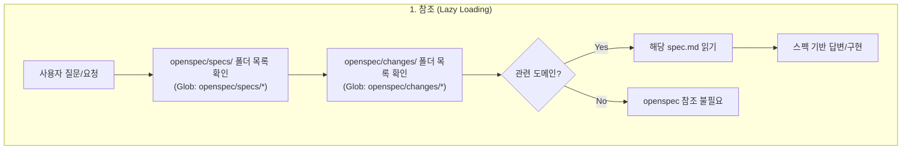
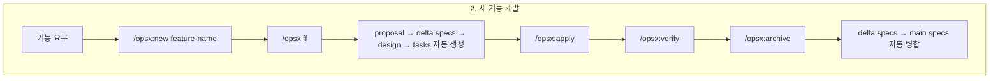
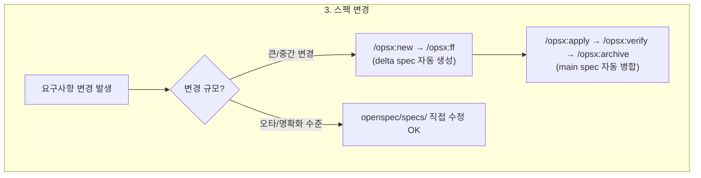
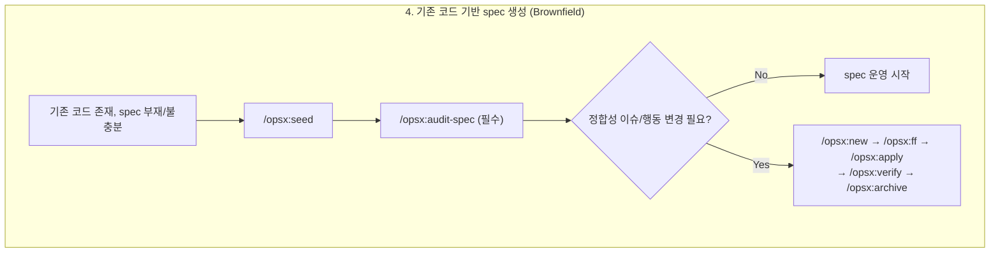
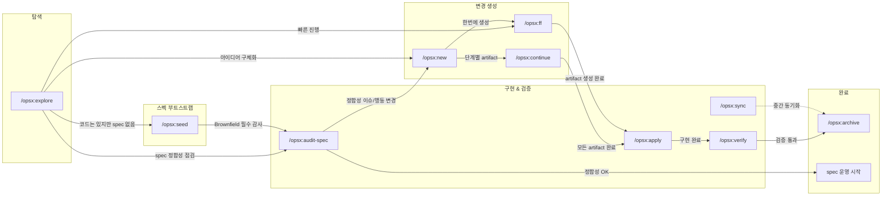

# OpenSpec 기반 SDD (Spec Driven Development) 전략

## Overview

OpenSpec의 `openspec/` 폴더를 프로젝트의 **single source of truth**로 삼고, AI Agent가 이를 자동 참조하여 스펙 기반으로 답변/구현/검증하는 워크플로우.

## 사용 방법 (중요)

이 경로에는 OpenSpec 기본 제공 외에 커스텀 스킬이 포함되어 있다.

- `opsx:seed` (기존 코드 기반 spec 생성, 커스텀 추가)
- `opsx:audit-spec` (main spec-코드 정합성 감사, 커스텀 추가)

또한 커스텀 플로우를 위해 기존 OpenSpec 스킬 일부를 오버라이드한다.

- `opsx:explore` (기존 `openspec-explore` 오버라이드)
- `opsx:new` (기존 `openspec-new-change` 오버라이드)
- `opsx:verify` (기존 `openspec-verify-change` 오버라이드)

네이밍 통일 규칙:
- Claude Code와 Codex 모두에서 스킬 `name`은 `/opsx:*` 커맨드와 동일한 네임스페이스로 통일한다.
- 즉, 명령어와 스킬 식별자를 같은 이름으로 맞춰 런타임 간 차이를 줄인다.

중요: 반드시 `openspec init`을 먼저 수행한 뒤, 이 전략의 `skills/` 내용을 프로젝트에 생성된 OpenSpec 스킬 위치에 **덮어써서** 사용해야 한다.

## 핵심 원칙

1. **Lazy Loading** — openspec/ 전체를 읽지 않고, 폴더 구조를 인덱스로 활용하여 필요한 파일만 읽는다
2. **opsx flow 강제** — 스펙 변경 시 직접 수정 금지, 반드시 `/opsx:new`부터 시작
3. **OpenSpec 기존 명령어 활용** — 별도 스킬 없이 opsx 명령어 + CLAUDE.md 규칙으로 운영

## 전체 SDD Flow






## 폴더 구조 = 인덱스

```
openspec/
├── specs/                    ← 도메인별 main spec (source of truth)
│   ├── auth/spec.md          ← 폴더명이 도메인 인덱스
│   ├── payments/spec.md
│   └── notifications/spec.md
├── changes/                  ← 활성 변경사항
│   ├── add-2fa/              ← 폴더명이 변경사항 인덱스
│   └── fix-login/
│       ├── proposal.md       (왜)
│       ├── specs/            (delta spec: ADDED/MODIFIED/REMOVED)
│       ├── design.md         (어떻게)
│       └── tasks.md          (단계)
└── changes/archive/          ← 완료된 변경 이력
    └── 2026-02-11-add-eval/
```

## opsx 명령어 요약

| 명령어 | 역할 | 언제 사용 | 출처 |
|--------|------|----------|------|
| `/opsx:explore` | 아이디어 탐색, 코드베이스 조사 | 요구사항 불명확할 때 | OpenSpec(오버라이드) |
| `/opsx:seed` | 기존 코드에서 초기 spec 생성 | 코드는 있지만 spec이 없을 때 | 커스텀(직접 추가) |
| `/opsx:audit-spec` | main spec과 코드 동작의 정합성 감사 | spec 정확도 점검/정기 점검 시 | 커스텀(직접 추가) |
| `/opsx:new` | 새 change 폴더 생성 | 새 기능 or 스펙 변경 시 | OpenSpec(오버라이드) |
| `/opsx:ff` | 전체 artifact 한번에 생성 | 명확한 요구사항일 때 | OpenSpec |
| `/opsx:continue` | artifact 하나씩 생성 | 단계별 리뷰가 필요할 때 | OpenSpec |
| `/opsx:apply` | tasks.md 기반 구현 | 구현 단계 | OpenSpec |
| `/opsx:verify` | 구현-스펙 일치 검증 | archive 전 | OpenSpec(오버라이드) |
| `/opsx:sync` | delta → main 병합 (archive 없이) | 장기 change의 중간 동기화 | OpenSpec |
| `/opsx:archive` | 완료 + archive + 병합 | 모든 작업 완료 시 | OpenSpec |

> `커스텀(직접 추가)` = OpenSpec 기본 제공이 아닌, 이 전략(`openspec-sdd`)에서 직접 추가한 명령/스킬

## 스킬 간 관계



**진입점별 흐름:**
- **새 프로젝트**: `/opsx:new` → `/opsx:ff` → `/opsx:apply` → `/opsx:verify` → `/opsx:archive`
- **기존 코드 문서화 (필수 감사)**: `/opsx:seed` → `/opsx:audit-spec`(필수) → (이슈 발견 시) `/opsx:new` → ...
- **기존 spec 점검**: `/opsx:audit-spec` → (이슈 발견 시) `/opsx:new` → ...
- **아이디어 단계**: `/opsx:explore` → `/opsx:seed` 또는 `/opsx:new` → ...
- **장기 변경**: ... → `/opsx:sync` (중간 병합) → ... → `/opsx:archive`

## Delta Spec 메커니즘

`/opsx:ff` (또는 `/opsx:continue`)에서 specs artifact 생성 시:
1. `schema.yaml`의 instruction이 CLI를 통해 AI에게 전달됨
2. AI가 **proposal.md** (변경 의도)와 **기존 main spec** (현재 상태)을 읽음
3. 차이를 판단하여 delta spec 작성 (ADDED/MODIFIED/REMOVED/RENAMED)

`/opsx:archive` 시:
- ADDED → main spec에 추가
- MODIFIED → 기존 requirement 교체
- REMOVED → main spec에서 삭제

> **주의:** delta 규칙은 OpenSpec 패키지 내부의 `schema.yaml` instruction에 정의되어 있으며, 프로젝트에서 직접 보이지 않음. `openspec schema fork`로 가시화 가능.

## openspec/config.yaml 활용

프로젝트별 `openspec/config.yaml`을 생성하여 **context와 per-artifact rules를 명시적으로 주입**할 수 있다.

- **context**: 모든 artifact 생성 시 주입됨
- **rules**: 해당 artifact에만 선택적 주입됨 — **artifact 간 의존성(무엇을 참조해야 하는지)을 명시**
- 패키지 내부 `schema.yaml`의 instruction에만 의존하지 않고, 프로젝트 레벨에서 delta 규칙을 가시화/강화

샘플: [config.yaml.example](./config.yaml.example)

> 참고: [OpenSpec Customization](https://github.com/Fission-AI/OpenSpec/blob/main/docs/customization.md)

## 검증 필요 사항

- [ ] `/opsx:new` → `/opsx:ff`로 스펙 변경 시 MODIFIED/REMOVED delta spec이 제대로 생성되는지
- [ ] `/opsx:archive`에서 delta → main 병합이 정확한지
- [ ] `/opsx:seed` → `/opsx:audit-spec`(필수) 경로가 안정적으로 동작하는지

## Decision Log

| # | 결정 | 대안 | 이유 |
|---|------|------|------|
| 1 | CLAUDE.md 규칙으로 참조 | 전용 스킬, INDEX.md | context 비용 최소화 |
| 2 | 폴더 구조를 인덱스로 활용 | INDEX.md 별도 파일 | 관리 부담 제로 |
| 3 | 스펙 변경 시 opsx flow 강제 | 직접 수정, /opsx:update 스킬 | OpenSpec이 delta 처리 |
| 4 | 별도 스킬 불필요 | opsx:update, context-loader | opsx 명령어 + CLAUDE.md로 충분 |
| 5 | config.yaml rules로 artifact 간 의존성 명시 | schema fork | 프로젝트 레벨에서 간단히 보완 |

## 관련 스킬 (미적용)

- **project-memory-manager**: OpenSpec과 느슨하게 통합 (회의 → `openspec new` 자동 실행, project.md에 링크)
- **daily-work-log-manager**: 직접 연결 없음, TODO와 OpenSpec task 연계 가능성은 있음
